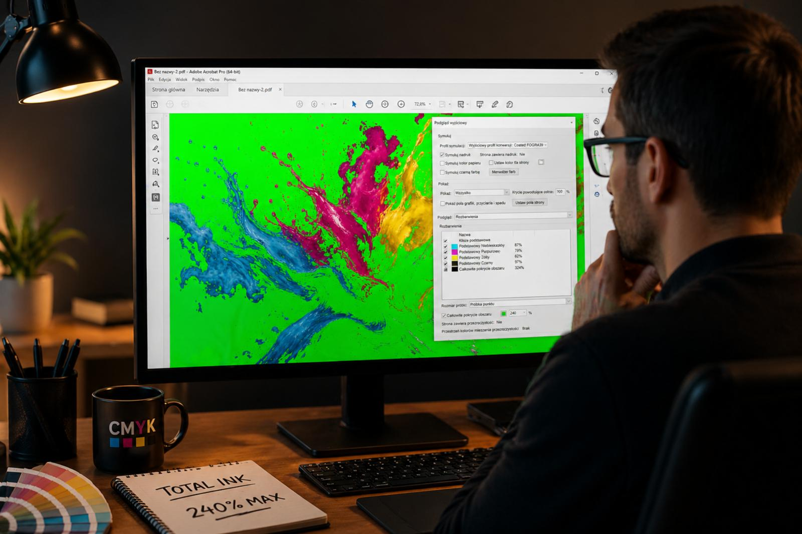
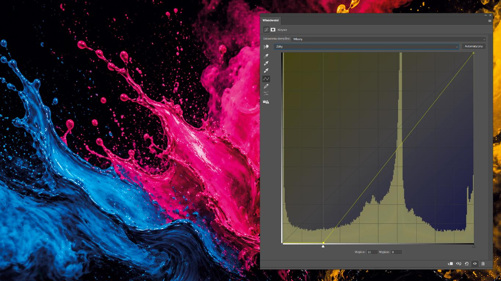
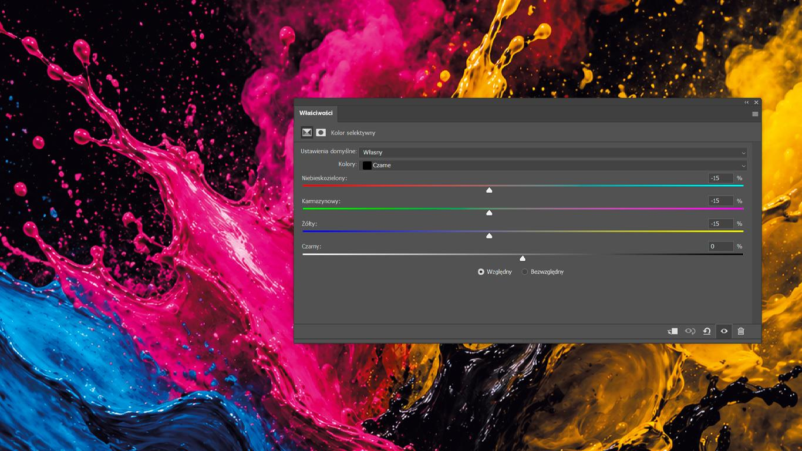
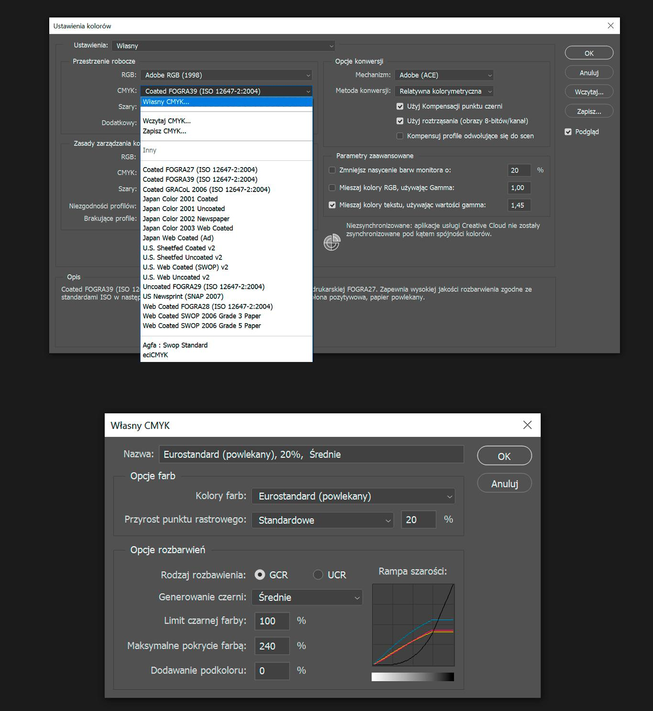

Grafiki generowane przez AI powstają w przestrzeni kolorów RGB, czyli tej, która jest przeznaczona do wyświetlania na ekranach. Jeśli jednak chcemy wykorzystać je w druku — musimy je przygotować do zupełnie innego środowiska. Druk działa w przestrzeni kolorów CMYK. Dlatego pierwszym krokiem zawsze jest konwersja grafiki z RGB do CMYK z użyciem odpowiedniego profilu kolorystycznego, najczęściej: **ISO Coated v2 (FOGRA39)**. To standardowy profil używany w DTP i dobry punkt wyjścia do dalszej pracy.

---

## Gdzie pojawia się problem

Po konwersji do CMYK bardzo często okazuje się, że grafika ma zbyt duże zabarwienie, czyli przekracza dopuszczalne pokrycie farbą (Total Ink Coverage, TAC). W praktyce oznacza to, że suma wszystkich składowych farb w jednym miejscu obrazu (C + M + Y + K) jest zbyt wysoka.  **Całkowite zabarwienie w pliku PDF przygotowanym do druku można sprawdzić w programie Adobe Acrobat Pro, korzystając z narzędzia _Podgląd wydruku (Output Preview)_ – po włączeniu opcji „Całkowite pokrycie obszaru” (Total Area Coverage) program pokazuje wartości TAC dla wskazanego miejsca oraz może wizualnie zaznaczyć obszary przekraczające zadany limit (np. 240%).** Alternatywnie w Photoshopie można użyć narzędzia pipety (_Eyedropper Tool_), które w panelu Informacje (_Info_) pokazuje wartości CMYK dla danego punktu – wystarczy zsumować C + M + Y + K, aby sprawdzić poziom zabarwienia. Przykładowo:

C=80%  
M=70%  
Y=70%  
K=90%  

daje łącznie aż 310% pokrycia farbą.

W druku cyfrowym — szczególnie w selfpublishingu i druku na żądanie (np. Empik Selfpublishing) — obowiązuje zwykle limit około: **240% TAC**. Zobacz: [specyfikację przygotowania plików do druku w Empik Selfpublishing](https://selfpublishing.empik.com/faq)

Ograniczenie to wynika z technologii druku i właściwości papieru — większa ilość farby nie jest w stanie zostać poprawnie odwzorowana. Tymczasem grafiki AI po konwersji do CMYK bardzo często przekraczają ten poziom i osiągają wartości rzędu 300% i więcej. W takiej formie nie spełniają wymogów drukarni selfpublishingowych i wymagają dodatkowego przygotowania przed eksportem do druku.

---

## Jak zmniejszyć zbyt duże zabarwienie

W Photoshopie można zrobić to na kilka sposobów. Poniżej trzy sprawdzone przeze mnie metody.

---

## Krzywe — praca bezpośrednio na kanałach

Pierwsza metoda daje największą kontrolę i opiera się na pracy bezpośrednio na kanałach CMYK.

Ścieżka:  
**Warstwa → Nowa warstwa dopasowania → Krzywe**

W krzywych wybierasz kolejno kanały:

Cyan  
Magenta  
Yellow  

i w każdym z nich delikatnie obniżasz cienie (prawą część krzywej). Kanału Black (K) nie zmieniasz. W ten sposób zmniejszasz ilość farb CMY w najciemniejszych partiach obrazu, gdzie TAC jest najwyższy, a jednocześnie zachowujesz udział czerni.

---

## Kolor selektywny — praca na cieniach obrazu

Drugie podejście opiera się na narzędziu Kolor selektywny (Selective Color).

Ścieżka:  
**Warstwa → Nowa warstwa dopasowania → Kolor selektywny**

Wybierasz:

**Czarne (Blacks)**

Wybór „Czarne” w Kolorze selektywnym odnosi się do zakresu tonalnego obrazu, a nie do kanału czarnego (K). Oznacza to pracę na najciemniejszych obszarach grafiki — tam, gdzie znajduje się najwięcej farby i gdzie najczęściej przekraczany jest dopuszczalny limit Total Ink (np. 240%).

Następnie zmniejszasz wartości:

Cyan  
Magenta  
Yellow  

a czarny pozostawiasz bez zmian lub lekko zwiększasz.

Kolor selektywny nie usuwa farby w sposób bezpośredni, lecz zmienia proporcje składowych CMYK w danym zakresie tonalnym. W praktyce oznacza to, że obraz może zmieniać odcień, jednak jednocześnie zmniejsza się ilość składowych CMY w najciemniejszych partiach obrazu. Dzięki temu całkowite zabarwienie (Total Ink) faktycznie spada — szczególnie jeśli redukcja CMY jest większa niż ewentualne zwiększenie składowej K. Należy jednak pamiętać, że jest to korekta wizualna, a nie precyzyjna kontrola wartości TAC — dlatego efekt warto zawsze sprawdzić w Acrobat Pro (Output Preview) lub w Photoshopie za pomocą pipety.

---

## Własna przestrzeń CMYK — szybkie ograniczenie TAC

Trzecia metoda polega na ustawieniu własnej przestrzeni CMYK w Photoshopie.

Ścieżka:  
**Edycja → Ustawienia kolorów → Przestrzeń robocza CMYK → Własny CMYK**

W tym miejscu możesz ustawić maksymalne pokrycie farbą (TAC), np. **240%**.

Dodatkowo masz do dyspozycji parametry:

- **GCR (Gray Component Replacement)** — odpowiada za zastępowanie CMY czernią  
- **Generowanie czerni** — określa intensywność użycia kanału K  
- **Limit czarnej farby** — maksymalna wartość dla czerni  
- **Maksymalne pokrycie farbą** — całkowita ilość farby  

Po ustawieniu tej przestrzeni roboczej otwierasz grafikę i konwertujesz ją do CMYK  
(**Edycja → Konwertuj do profilu**).

Photoshop przelicza kolory zgodnie z tymi parametrami i automatycznie ogranicza całkowite pokrycie farbą.

To rozwiązanie pozwala szybko osiągnąć poprawny technicznie efekt, jednak może wpłynąć na kolorystykę obrazu.  
Dlatego często wymaga dalszej korekty (np. przy użyciu Koloru selektywnego lub krzywych).

Warto również pamiętać, że ustawienie „Własny CMYK” nie jest profilem ICC, lecz uproszczoną symulacją separacji kolorów.  
W profesjonalnym druku stosuje się profile ICC (np. FOGRA), jednak w przypadku selfpublishingu i braku dedykowanego profilu metoda ta jest praktycznym sposobem na kontrolę Total Ink.

---

## Na koniec

Grafiki AI są tworzone w przestrzeni RGB i wymagają dostosowania do druku.

W przypadku selfpublishingu i druku cyfrowego kluczowe jest spełnienie wymagań technicznych, w tym ograniczenia pokrycia farbą do około 240%.

Sama konwersja do CMYK to dopiero pierwszy krok. Kolejnym jest świadome przygotowanie grafiki tak, aby była zgodna z wymaganiami produkcyjnymi i mogła zostać poprawnie wydrukowana.

Jeśli potrzebujesz pomocy w przygotowaniu grafik do druku w selfpublishingu, możesz skontaktować się ze mną przez stronę:
**[Elfa Publikacje](https://elfapublikacje.com/)**