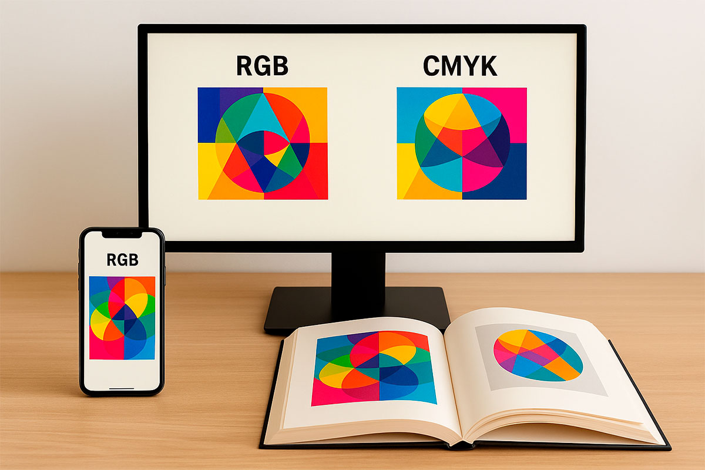
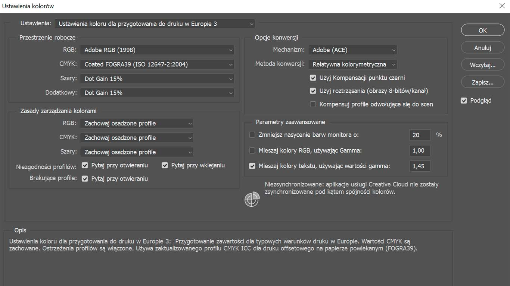
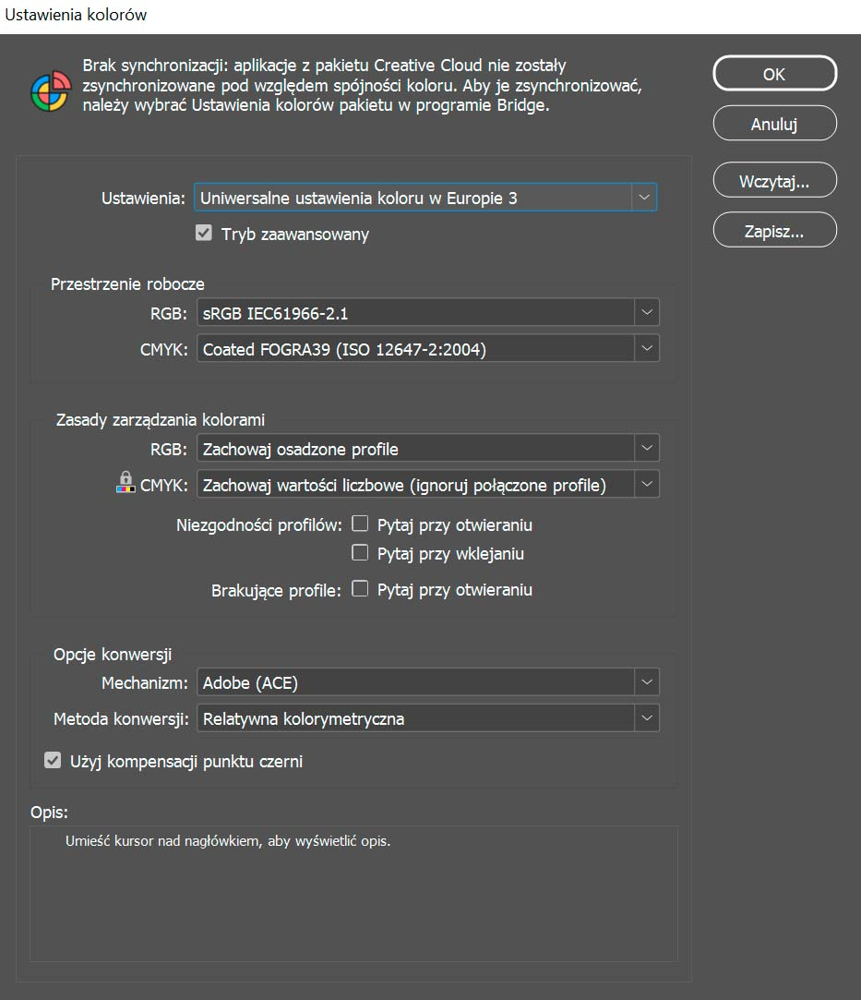
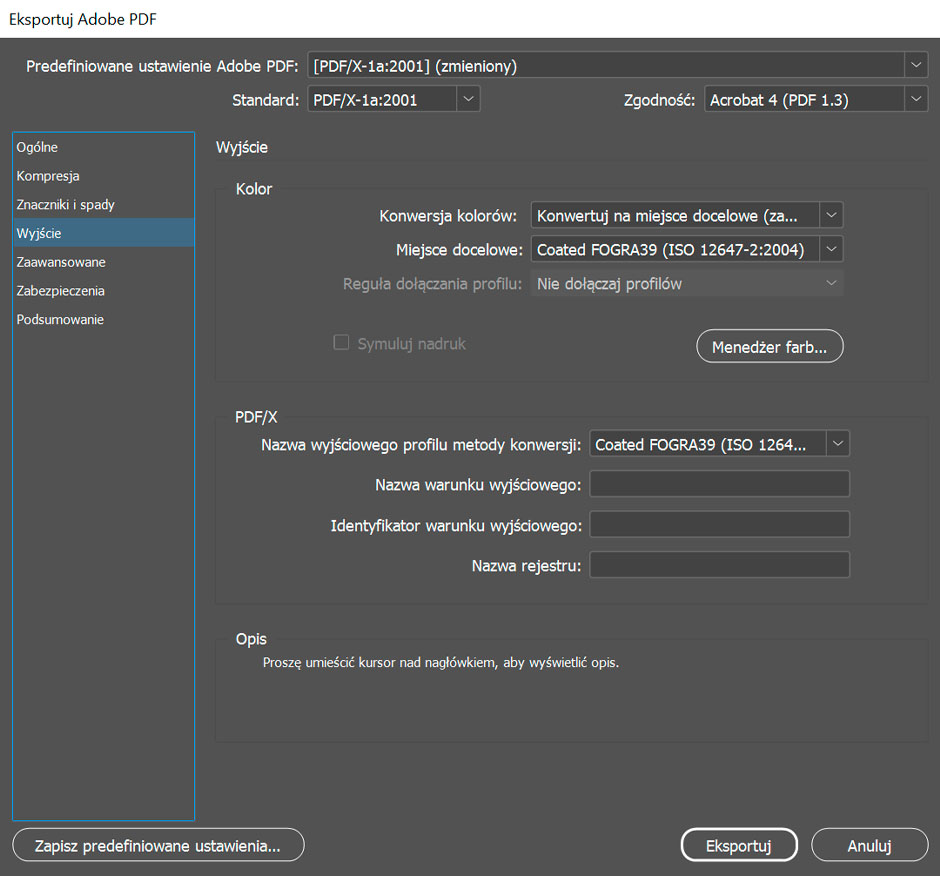

# Profile kolorystyczne – przewodnik dla początkujących

Kolory potrafią płatać figle. To, co na ekranie wygląda soczyście i jaskrawo, w druku może wyjść bardziej matowe albo w innym tonie niż na ekranie. Dlaczego tak się dzieje? Dzieje się tak dlatego, że obraz na ekranie powstaje w innym systemie kolorów niż w druku, a ich zgodność kontrolują profile ICC.

W tym wpisie wyjaśnię:
- czym różni się RGB od CMYK,  
- czym są profile ICC i co opisują,  
- jak wygląda praktyczny flow pracy z profilami w Photoshopie i InDesignie,  
- jakie błędy łatwo popełnić i jak ich uniknąć.  

---

## RGB a CMYK – dwa światy

### RGB – kolory światła
RGB (Red, Green, Blue) to przestrzeń barw używana przez urządzenia działające ze **światłem** – monitory, aparaty, smartfony, telewizory.  
Każdy piksel świeci w różnych proporcjach trzech barw, co daje ogromną gamę kolorów.  

Zdjęcia startują w RGB, dlatego fotografie z aparatów i telefonów zapisują się właśnie w tej przestrzeni.

### CMYK – kolory farby
CMYK (Cyan, Magenta, Yellow, Black) to przestrzeń dla druku, gdzie kolory powstają przez **nakładanie farb na papier**.  
Ta przestrzeń ma mniejszy gamut niż RGB, więc niektóre jaskrawe barwy z monitora nie są możliwe do wiernego odwzorowania w druku.  

Zadaniem profili kolorystycznych jest bezpieczne przeprowadzenie obrazu z jednego świata do drugiego – z RGB do CMYK.

---

## Co to są profile kolorystyczne?

Najprościej mówiąc: **profil kolorystyczny to słownik**, który mówi komputerowi, jak rozumieć kolory.  

Każde urządzenie widzi świat trochę inaczej:
- aparat zapisuje zdjęcie w przestrzeni RGB,  
- skaner ma własny profil,  
- monitor wyświetla kolory według swojego profilu,  
- drukarka i maszyna drukarska pracują w przestrzeni CMYK.  

Bez profili każdy widziałby „czerwony” po swojemu. Dzięki nim można przełożyć kolor z jednego urządzenia na drugie i zachować spójność.  

---

## Co opisuje profil ICC?

Profil ICC (International Color Consortium) to matematyczny opis, jak zachowuje się system kolorów w danych warunkach.  
W przypadku profili drukarskich (CMYK) bierze pod uwagę m.in.:  

- **Rodzaj papieru** – powlekany, niepowlekany, gazetowy, recyklingowy, kreda, Munken itp. Papier wpływa na chłonność i kontrast.  
- **Rodzaj farby** – offsetowe, szybkoschnące, ekologiczne, dla druku cyfrowego – każda inaczej oddaje intensywność i głębię kolorów.  
- **Maszyna drukarska i technologia** – offset arkuszowy, zwojowy, cyfrowy, laserowy – każda ma inne ograniczenia gamutu.  
- **Maksymalne pokrycie farbą (TAC)** – np. w FOGRA39 TAC = 300%, a w profilach gazetowych tylko 240%.  
- **Biel podłoża** – kreda jest bielsza, Munken bardziej kremowy, gazeta szara. Profil uwzględnia to jako „tło” symulacji.  

Profil opisuje więc **cały system druku: papier + farby + technologia + ograniczenia + kolor podłoża**.  

---

## Jak działają profile w praktyce?

Dzięki profilom w Photoshopie czy InDesignie możesz:
- zobaczyć **soft proof** (symulowany podgląd wydruku),  
- sprawdzić, czy wybrane kolory da się wiernie wydrukować,  
- przewidzieć, jak zmieni się wygląd projektu na różnych papierach.  

Dlatego tak ważne jest, żeby **używać profilu podanego przez drukarnię** – tylko on odpowiada realnym parametrom ich maszyn.

---

## Workflow z profilami w programach

### Photoshop – zacznij od zachowania profilu
Zdjęcie z aparatu czy skanera ma osadzony profil (np. sRGB albo AdobeRGB).  
W Photoshopie najczęściej warto:
- zachować profil osadzony – program pokaże kolory zgodnie z plikiem,  
- ustawić profil roboczy, który pozwala zasymulować, jak obraz będzie wyglądał w druku.  
  

*Rys. 1. Ustawienia kolorów w Photoshopie – zachowujemy profile osadzone.*  

To najprostszy i bezpieczny start to wybór presetu Europe Prepress 3. Ustawia on FOGRA39 jako profil CMYK dla druku offsetowego i synchronizuje ustawienia między programami Adobe. Dzięki temu masz spójne środowisko pracy w Photoshopie, Illustratorze i InDesignie.

---

### InDesign – skład w spójnej przestrzeni
InDesign również korzysta z profili.  
Najlepiej:
- ustawić profil roboczy dokumentu (np. *Europe Prepress 3*),  
- pozwolić importowanym zdjęciom zachować własne profile,  
- nie konwertować od razu – spójność projektu trzymamy do końca. 

*Rys. 2. Ustawienia kolorów w InDesignie – zachowaj osadzone profile.*  

Również W InDesignie najprościej wybrać preset Europe Prepress 3. Ustawia on sRGB jako przestrzeń roboczą dla obrazów RGB i FOGRA39 jako domyślny profil CMYK. Dzięki temu masz spójny podgląd kolorów i przygotowujesz plik zgodnie ze standardem druku w Europie.

---

### Eksport do PDF – moment decyzji
Na końcu, przy eksporcie do PDF, wybierasz profil drukarni jako **Output Intent**.  
Najczęściej spotykane:
- **FOGRA39** – druk offsetowy na papierze powlekanym,  
- **FOGRA52** – druk na papierze niepowlekanym.  

W InDesignie:  
`Plik → Eksportuj → Adobe PDF (druk) → Wyjście (Output)` → wybierz właściwy profil ICC. 

*Rys. 3. Eksport PDF w InDesignie – wybór profilu FOGRA39 jako Output Intent.*  

Przy eksporcie do PDF wybierz standard PDF/X i odpowiedni profil ICC jako Output Intent – najczęściej FOGRA39 dla papierów powlekanych lub FOGRA52/PSO Uncoated dla papierów niepowlekanych. To właśnie w tym miejscu decydujesz o końcowej przestrzeni kolorów dla druku. Drukarnia może przekazać Ci własny profil ICC – przygotowany specjalnie pod ich maszyny, farby i papiery. Wtedy zamiast standardowego FOGRA39 czy FOGRA52 należy użyć właśnie tego profilu. To gwarantuje, że kolory będą odwzorowane dokładnie tak, jak w ich warunkach produkcyjnych.

---

## Jedna z możliwych dróg

W praktyce są różne podejścia do zarządzania kolorami.  
Ja często rekomenduję prostą ścieżkę:
- zachowaj profile na etapie pracy w Photoshopie i InDesignie,  
- konwertuj dopiero przy eksporcie do PDF.  

Dlaczego? Bo to najbezpieczniejsza metoda, jeśli nie ma szczególnych powodów, by zmieniać profile wcześniej.  
Ale jeśli drukarnia wymaga konkretnej przestrzeni już na etapie przygotowania grafik – możesz oczywiście konwertować wcześniej.  

---

## Po co to wszystko?

Ktoś mógłby zapytać: czy nie wystarczy „zapisać plik i wysłać do druku”?  
Niestety nie. Bez profili:
- monitor pokazuje jedno, a drukarnia drukuje co innego,  
- kolory tracą spójność między zdjęciami,  
- trudno przewidzieć efekt końcowy.  

Profile kolorystyczne to narzędzie kontroli – dzięki nim masz pewność, że to, co widzisz na ekranie, będzie miało sens na papierze.  

---

## Podsumowanie – flow pracy z profilami

1. **Photoshop** – pracuj na zdjęciach z ich osadzonym profilem. Profil roboczy pozwala Ci podglądać symulację druku, ale nie musisz konwertować od razu.  
2. **InDesign** – składaj publikację, zachowując osadzone profile obrazów. Profil roboczy dokumentu daje Ci pogląd, jak kolory będą wyglądać w druku.  
3. **Eksport do PDF** – tu wybierasz profil drukarni (Output Intent). To on gwarantuje, że kolory będą dopasowane do papieru i maszyny.  

To jedna z dróg, którą polecam – dzięki niej nie pogubisz kolorów i zachowasz kontrolę aż do końca.  

---

## 3 błędy, których łatwo uniknąć

- **Brak profilu w pliku** – zdjęcie bez osadzonego profilu może wyglądać inaczej w każdym programie.  
- **Wielokrotne konwersje** – każda zmiana przestrzeni zjada trochę jakości koloru. Lepiej konwertować tylko raz, na końcu.  
- **Ignorowanie profilu drukarni** – nawet najlepiej przygotowany PDF bez odpowiedniego profilu może dać niespodzianki.  

---

##Jesteś ilustratorem i chcesz wiedzieć, jak przygotować swoje prace do druku?  
[Przeczytaj przewodnik dla ilustratorów](/jak-przygotowac-ilustracje-do-druku)

---

